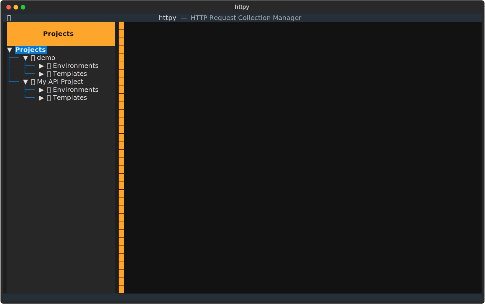
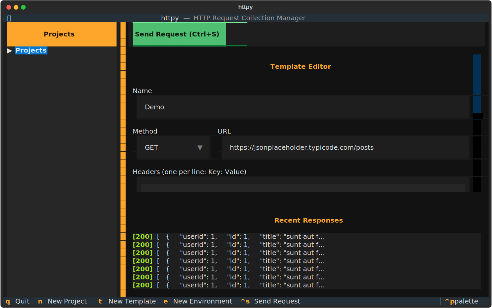

# httpy

A terminal-based HTTP request collection manager. Organize API requests into projects, use environment variables for configuration, and execute requests — all from a rich TUI or directly via the Python API.

## Screenshots

### Main View

<p align="center">
  
</p>

### Template Editor

<p align="center">
  
</p>

## Features

- **Projects** — Group related HTTP requests together
- **Request Templates** — Define reusable requests with `{{placeholder}}` variable support
- **Environments** — Switch between configurations (dev, staging, production) with named key-value pairs that get substituted into templates
- **Response History** — Every response is persisted to disk per template; browse recent responses in the TUI
- **TUI** — Full terminal interface built with [Textual](https://github.com/Textualize/textual)
- **Python API** — Use `httpy` as a library for scripting and automation
- **Typed** — Ships with `py.typed` marker for full type-checking support

## Requirements

- Python 3.14+
- [uv](https://docs.astral.sh/uv/) (recommended for dependency management)

## Installation

```bash
# Clone the repository
git clone https://github.com/your-username/httpy.git
cd httpy

# Install with uv
uv sync
```

## Usage

### TUI

Launch the terminal interface:

```bash
uv run httpy
```

#### Keyboard Shortcuts

| Key       | Action              |
|-----------|---------------------|
| `n`       | New Project         |
| `t`       | New Template        |
| `e`       | New Environment     |
| `Ctrl+S`  | Send Request        |
| `q`       | Quit                |

#### Workflow

1. Press `n` to create a new project
2. Press `e` to add an environment with key-value configs (e.g. `BASE_URL`, `API_KEY`)
3. Press `t` to create a request template — use `{{KEY}}` placeholders in the URL, headers, or body
4. Select a template from the sidebar to open the editor
5. Choose an environment and press `Ctrl+S` (or click **Send Request**) to execute
6. View the response and browse response history for the template

### Python API

```python
from httpy import (
    HttpyProject,
    HttpyRequestTemplate,
    HttpyEnvironment,
)
from httpy.core.request_handler import HttpyRequestHandler
from httpy.io import save_project, load_project

# Define an environment
env = HttpyEnvironment(
    name="Production",
    configs={
        "BASE_URL": "https://jsonplaceholder.typicode.com",
        "API_KEY": "secret",
    },
)

# Define a request template
template = HttpyRequestTemplate(
    name="Get Todo",
    method="GET",
    url="{{BASE_URL}}/todos/1",
    headers={"Authorization": "Bearer {{API_KEY}}"},
    parameters={},
    body="",
)

# Create a project
project = HttpyProject(
    name="My API Project",
    description="Example project",
    request_handler=HttpyRequestHandler(),
    environments=[env],
    templates=[template],
)

# Save to disk
save_project(project, include_templates=True)

# Load from disk
project = load_project("My API Project", include_templates=True)

# Execute a request
request = project.make_request(template, env)
response = project.execute_request(request)

print(response.status_code)
print(response.render_json())
```

## Project Structure

```
httpy/
├── src/httpy/
│   ├── core/               # Domain models and logic
│   │   ├── project.py      # HttpyProject — groups templates & environments
│   │   ├── template.py     # HttpyRequestTemplate — reusable request definitions
│   │   ├── environment.py  # HttpyEnvironment — key-value config sets
│   │   ├── request.py      # HttpyRequest — resolved request ready to send
│   │   ├── response.py     # HttpyResponse — status, headers, body
│   │   └── request_handler.py  # HTTP execution via requests library
│   ├── io/                 # Persistence layer (JSON on disk)
│   ├── tui/                # Terminal UI (Textual)
│   │   ├── app.py          # Main application
│   │   ├── screens/        # Modal screens (new project/template/environment)
│   │   └── widgets/        # Sidebar, editors, response viewer, history
│   └── utils/              # Logging helpers
├── tests/                  # pytest test suite
├── examples/               # Demo scripts
└── pyproject.toml
```

## Data Storage

Projects are stored under a `projects/` directory (configurable via `set_basepath()`). Each project gets its own folder, and each template gets a subfolder containing its definition and response history:

```
projects/
└── my_api_project/
    ├── project.json
    ├── <template-uuid>/
    │   ├── template.json
    │   └── responses/
    │       ├── 20260415_142301_000000.json
    │       └── 20260415_143012_000000.json
    └── <template-uuid>/
        ├── template.json
        └── responses/
```

## Development

```bash
# Install dev dependencies
uv sync

# Run tests
uv run pytest tests/ -v

# Run tests with coverage
uv run pytest tests/ --cov=httpy

# Run the TUI
uv run httpy

# Run the demo script
uv run python examples/demo_api_usage.py
```

## License

See [LICENSE](LICENSE) for details.